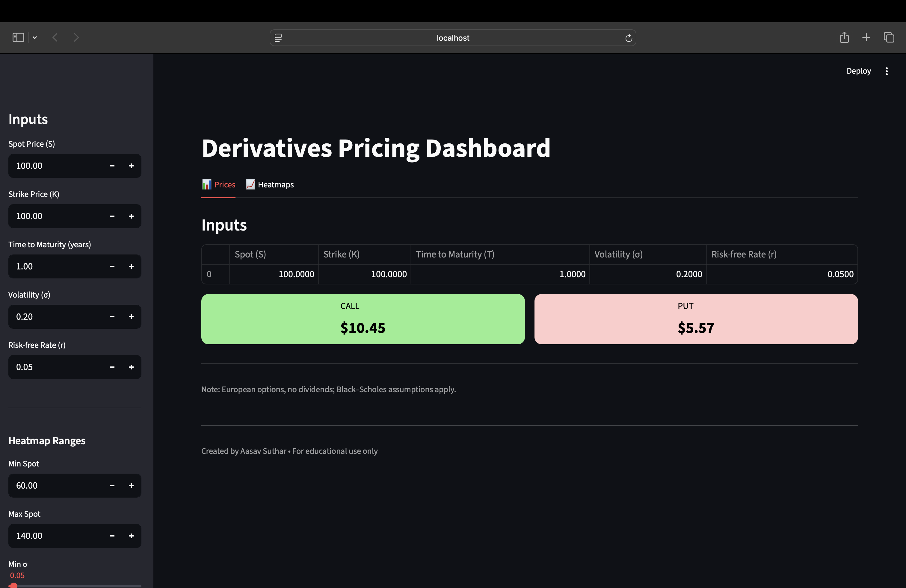
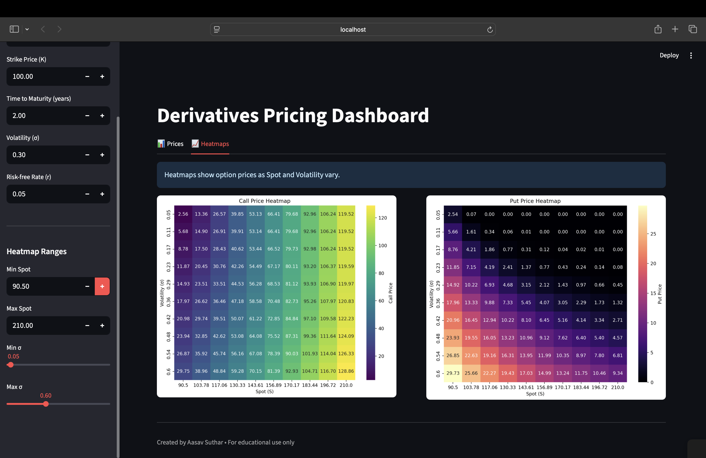

# 📊 Derivatives Pricing Dashboard

An interactive **Black–Scholes option pricing dashboard** built with **Streamlit**, enabling users to explore how option prices behave under different market conditions.  
The app is designed for clarity and experimentation — perfect for students, researchers, and finance enthusiasts.

---

## 🚀 Features

- **Option Pricing Calculator**
  - Compute European **Call** and **Put** option prices instantly.
  - Visualize values in a clean, responsive layout.

- **Interactive Heatmaps**
  - Explore how option prices vary with **Spot Price** and **Volatility** ranges.
  - Side-by-side heatmaps for quick comparison of Call vs. Put dynamics.

- **Customizable Inputs**
  - Spot Price (S)  
  - Strike Price (K)  
  - Time to Maturity (T, in years)  
  - Volatility (σ)  
  - Risk-Free Rate (r)  
  - User-defined ranges for Spot Price and Volatility for heatmaps.

---
## 🔧 Dependencies

- **pandas**: For handling and displaying tabular input/output data  
- **numpy**: For mathematical and numerical operations  
- **scipy**: For statistical functions  
- **matplotlib**: For plotting static heatmaps  
- **seaborn**: For visually enhanced heatmap styles  

##  Results

### Dashboard Overview

  
  

